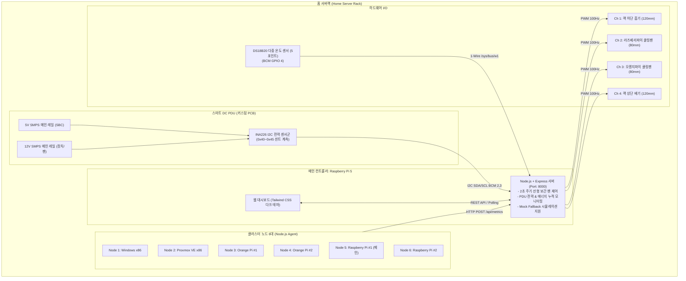
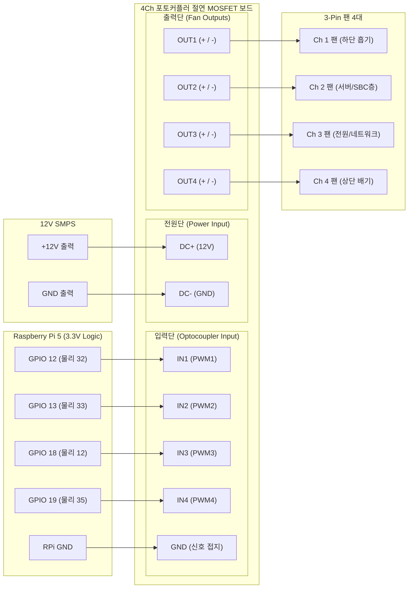
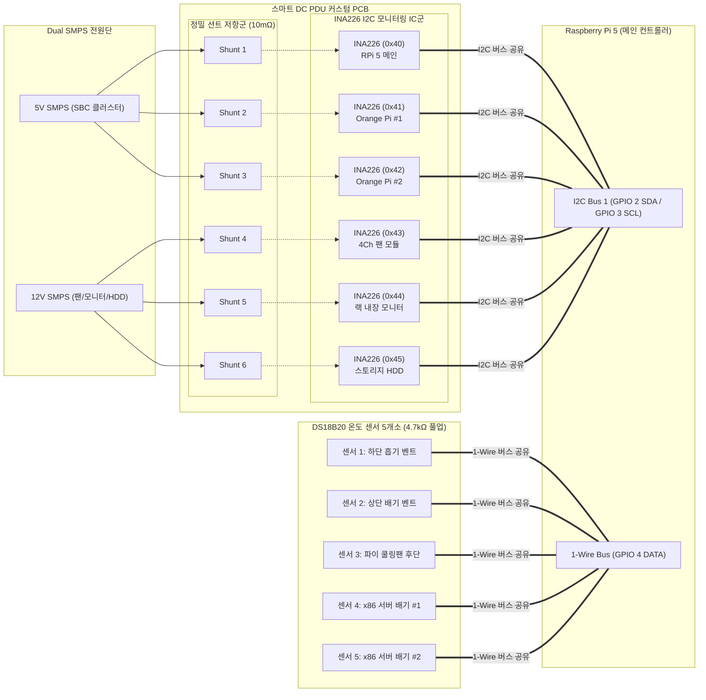

# 홈 서버랙 통합 모니터링 & 4채널 스마트 팬 컨트롤러 (Node.js)

**Raspberry Pi 5**를 메인 컨트롤러로 활용하여 홈 서버랙 내부의 다중 노드(총 6대: Windows x86, Proxmox VE, Orange Pi 2대, Raspberry Pi 2대) 상태를 실시간 수집하고, 1-Wire DS18B20 온도 센서 및 4채널 PWM 팬을 자동/수동으로 제어하는 스마트 컨트롤러 시스템입니다.

**순수 Node.js & Express 기반**으로 구축되어 가볍고 빠른 반응성과 높은 안정성을 제공합니다.

---

## 1. 시스템 아키텍처 (System Architecture)



---

## 2. 하드웨어 핀맵 및 4채널 포토커플러 MOSFET 모듈 배선도

본 시스템은 회로를 단순화하고 신뢰성을 극대화하기 위해 **3-Pin 팬 전용**으로 구성되며, 라즈베리파이의 3.3V GPIO를 보호하는 **"4Ch PWM MOSFET Switch Controller (포토커플러 절연 드라이버 보드)"**를 사용합니다.



### 2.1 Raspberry Pi 5 핀맵

| 기능 / 채널 | BCM GPIO | 물리 핀 번호 | 보드 연결 터미널 |
| :--- | :--- | :--- | :--- |
| **1-Wire 데이터 (DS18B20)** | **GPIO 4** | 7번 핀 | 3.3V와 데이터 라인 사이에 **4.7kΩ 풀업 저항** 연결 |
| **팬 채널 1 (하단 흡기)** | **GPIO 12** | 32번 핀 | 모듈 `IN1` (PWM 1) |
| **팬 채널 2 (서버/SBC층)** | **GPIO 13** | 33번 핀 | 모듈 `IN2` (PWM 2) |
| **팬 채널 3 (전원/네트워크)** | **GPIO 18** | 12번 핀 | 모듈 `IN3` (PWM 3) |
| **팬 채널 4 (상단 배기)** | **GPIO 19** | 35번 핀 | 모듈 `IN4` (PWM 4) |
| **신호 접지 (Signal GND)** | GND | 6, 9, 14, 20, 30, 34, 39번 핀 | 모듈 입력단 `GND` |

---

### 2.2 4채널 포토커플러 MOSFET 보드 상세 배선 안내

1. **입력단 (Raspberry Pi 5 신호 연결)**:
   - 라즈베리파이의 GPIO 12, 13, 18, 19 핀을 모듈의 `IN1`, `IN2`, `IN3`, `IN4` 단자에 연결합니다.
   - 라즈베리파이의 GND 핀을 모듈 입력단의 `GND` 단자에 연결합니다.
   - *장점*: 포토커플러(PC817) 내부의 광학적 절연을 통해 팬 모터 구동 시 발생하는 노이즈나 역전압이 라즈베리파이에 전혀 유입되지 않아 GPIO를 안전하게 보호합니다.

2. **전원단 (12V SMPS 연결)**:
   - 12V SMPS의 `+12V`를 모듈의 `DC+` 단자에 연결합니다.
   - 12V SMPS의 `GND(-)`를 모듈의 `DC-` 단자에 연결합니다.

3. **출력단 (3-Pin 팬 연결)**:
   - **팬 1 (하단 흡기)**: 빨간선(+) ➡️ `OUT1+`, 검정선(-) ➡️ `OUT1-`
   - **팬 2 (서버/SBC층)**: 빨간선(+) ➡️ `OUT2+`, 검정선(-) ➡️ `OUT2-`
   - **팬 3 (전원/네트워크)**: 빨간선(+) ➡️ `OUT3+`, 검정선(-) ➡️ `OUT3-`
   - **팬 4 (상단 배기)**: 빨간선(+) ➡️ `OUT4+`, 검정선(-) ➡️ `OUT4-`
   - *참고*: 3-Pin 팬의 세 번째 선(노란색/흰색, Tach RPM 감지선)은 모듈에 연결할 필요가 없으므로 절연 테이프로 마감해 두시면 됩니다.

---

### 2.3 소프트웨어 킥스타트 및 스톨 방지

3-Pin DC 팬은 저전압에서 모터 정지 마찰력으로 멈추는 현상이 발생할 수 있으므로, 본 시스템에서는 다음 보호 기능을 자동으로 수행합니다:
- **소프트웨어 킥스타트 (Kickstart)**: 팬이 정지 상태(0%)에서 가동될 때 **약 350ms 동안 순간 100% 펄스**를 인가하여 마찰력을 극복한 뒤 설정된 듀티비로 안착합니다.
- **최저 듀티 안전 마진 (`min_duty: 35%`)**: 팬 가동 시 최소 35% 이상으로 자동 유지하여 모터 스톨 및 고주파 험(Hum) 소음을 원천 방지합니다.

---

## 3. 스마트 DC PDU & 커스텀 PCB 하드웨어 설계 가이드 (Dual SMPS & INA226)

서버랙 내부의 복잡한 어댑터와 콘센트 수를 줄이고, 기기별 전력 소비량을 정밀 모니터링하기 위한 **스마트 DC PDU 커스텀 PCB** 설계 가이드입니다.



### 3.1 Dual SMPS 전원 분배 사양
1. **5V SMPS 메인 레일 (SBC 클러스터 전용)**:
   - 라즈베리파이 5 메인 보드 (피크 ~5A 지원 권장)
   - 오렌지파이 #1, #2 (각각 2~3A)
   - 저전압 드롭(Brownout) 방지를 위해 두꺼운 구리 패턴(또는 2oz 동박) 및 출력 필터 커패시터 배치
2. **12V SMPS 메인 레일 (장치/쿨링 전용)**:
   - 4채널 3핀 팬 컨트롤러 모듈 (총 1~2A)
   - 랙 내장 모니터 (1~2A)
   - 3.5인치/2.5인치 스토리지 HDD 12V 전원 라인

### 3.2 INA226 I2C 주소 설정 (멀티플렉서 불필요)
INA226은 A0, A1 핀을 각각 GND, VS+, SDA, SCL에 결선하는 조합으로 **단일 I2C 버스에서 최대 16개 주소(0x40 ~ 0x4F)**를 가질 수 있습니다:
* `0x40` (A1=GND, A0=GND): 라즈베리파이 5
* `0x41` (A1=GND, A0=VS+): 오렌지파이 #1
* `0x42` (A1=GND, A0=SDA): 오렌지파이 #2
* `0x43` (A1=GND, A0=SCL): 4채널 팬 모듈 (12V)
* `0x44` (A1=VS+, A0=GND): 랙 내장 모니터 (12V)
* `0x45` (A1=VS+, A0=VS+): 스토리지 HDD (12V)
* **션트 저항 권장**: 10mΩ (0.01Ω), 1% 오차 정밀 저항 (2512 패키지 권장)

### 3.3 DS18B20 1-Wire 5채널 센서 배치
* 모든 센서는 단일 데이터 라인(RPi 5 GPIO 4)과 3.3V 사이에 **4.7kΩ 풀업 저항 1개만 공통 연결**하면 병렬 버스로 동작합니다.
* 공장에서 출하된 센서마다 고유 64비트 식별 번호(`28-xxxxxxxxxxxx`)가 하드코딩되어 있으므로, 5개를 구입하여 병렬 연결한 뒤 **웹 대시보드에서 센서 카드의 연필(✏️) 아이콘을 클릭하여 각각 원하는 한글 이름(별칭)으로 손쉽게 지정**할 수 있습니다.

---

## 4. 디렉터리 구조

```text
rpi-RackController/
├── package.json               # Node.js 의존성 (Express, CORS)
├── config.json                # 서버 포트, 4채널 PWM 핀, 팬 커브 임계값 및 센서 별칭
├── server/                    # 메인 컨트롤러 (Raspberry Pi 5)
│   ├── server.js              # Express HTTP 서버 및 REST API 엔드포인트
│   ├── controller.js          # 상태 관리, 2초 주기 선형 보간 팬 제어 로직
│   ├── hardware.js            # DS18B20 온도 리딩 & 4채널 PWM 제어 (Mock Fallback 포함)
│   └── static/
│       ├── index.html         # Tailwind CSS 다크 모드 실시간 대시보드
│       └── app.js             # 실시간 상태 폴링, 슬라이더 드래그 락, 별칭 수정 모달
├── agent/                     # 6대 노드용 모니터링 에이전트
│   ├── agent.js               # Node.js 기반 크로스 플랫폼 메트릭 수집 스크립트
│   └── agent_config.json      # 서버 URL, Node ID, 전송 주기 설정
├── deploy/                    # 서비스 등록 및 자동 실행 스크립트
│   ├── rack-server.service    # RPi 5 메인 서버용 systemd 서비스 파일
│   ├── rack-agent.service     # Linux 노드용 systemd 서비스 파일
│   └── start_win_agent.bat    # Windows 노드용 실행 배치 파일
└── tests/                     # 통합 테스트
    └── test_node_server.js    # Node.js 전체 API 및 팬 제어 자동화 테스트
```

---

## 5. 메인 컨트롤러 설치 및 실행 (Raspberry Pi 5)

### 5.1 의존성 설치
```bash
npm install
```

### 5.2 서버 직접 실행
```bash
node server/server.js
```
웹 브라우저에서 `http://192.168.219.118:8000` (또는 해당 IP)로 접속하여 대시보드를 확인합니다.

### 5.3 PM2 프로세스 관리 및 자동 시작 (권장)
현재 PM2를 통해 서버와 에이전트가 관리되며, 라즈베리파이 부팅 시 자동으로 복원되도록 설정되어 있습니다:

```bash
# 전체 상태 확인
pm2 status

# 실시간 로그 확인
pm2 logs

# 프로세스 재시작
pm2 restart rack-server
pm2 restart rack-agent

# 프로세스 상태 저장 (수정 후 영구 저장 시)
pm2 save
```

---

## 6. 원격 모니터링 에이전트 배포 (6대 노드)

### 6.1 Linux 노드 (Proxmox VE, Ubuntu, Debian, Armbian, Raspberry Pi)
1. 노드에 Node.js 설치 (Node.js 18+ 권장):
   ```bash
   sudo apt install -y nodejs
   ```
2. `agent/agent_config.json` 설정:
   ```json
   {
     "server_url": "http://192.168.219.118:8000",
     "node_id": "proxmox-01",
     "interval_seconds": 3,
     "timeout_seconds": 5
   }
   ```
3. 에이전트 실행 또는 서비스 등록:
   ```bash
   sudo mkdir -p /opt/rack-agent
   sudo cp agent/agent.js agent/agent_config.json /opt/rack-agent/
   sudo cp deploy/rack-agent.service /etc/systemd/system/
   sudo systemctl daemon-reload
   sudo systemctl enable --now rack-agent.service
   ```

### 6.2 Windows x86 노드
1. Windows용 [Node.js 공식 홈페이지](https://nodejs.org)에서 Node.js 설치
2. `agent/` 폴더 복사 후 `agent_config.json` 서버 URL 수정
3. `deploy\start_win_agent.bat` 실행 (또는 작업 스케줄러 등록)

---

## 7. 팬 자동 제어 알고리즘 (Fan Curve Logic)

`server/controller.js`는 2초 주기로 백그라운드에서 동작하며, 랙 내부 DS18B20 센서 최고 온도와 온라인 노드의 CPU 최고 온도를 기반으로 선형 보간(Linear Interpolation)을 수행합니다:

$$Duty = \max\left(Duty_{rack}, Duty_{node}, Duty_{min}\right)$$

* **랙 온도 커브**: 30°C 이하 = 30% 듀티 / 50°C 이상 = 100% 듀티
* **노드 CPU 커브**: 45°C 이하 = 30% 듀티 / 80°C 이상 = 100% 듀티
* 웹 대시보드 상단 설정(⚙️) 아이콘을 통해 모든 임계값을 실시간으로 변경할 수 있으며 `config.json`에 영구 저장됩니다.

---

## 8. 주요 REST API 명세

| Method | Endpoint | 설명 |
| :--- | :--- | :--- |
| `GET` | `/api/status` | 전체 노드, 1-Wire 센서, 팬 채널, 스마트 DC PDU 전력 종합 조회 |
| `POST` | `/api/metrics` | 노드 에이전트로부터 시스템 메트릭 수신 |
| `POST` | `/api/fans` | 팬 모드(`auto_mode`) 및 채널별 수동 듀티비(`manual_duties`) 변경 |
| `POST` | `/api/config/sensor` | DS18B20 센서 추가 및 별칭 수정 (`sensor_id`, `alias`) |
| `DELETE` | `/api/config/sensor/:id` | 등록된 DS18B20 센서 삭제 |
| `POST` | `/api/config/fan` | 팬 채널 추가 및 설정 수정 (`channel`, `name`, `gpio`, `min_duty`, `default_duty`) |
| `DELETE` | `/api/config/fan/:channel` | 등록된 팬 채널 삭제 |
| `POST` | `/api/config/pdu-channel` | PDU 소비전력 분기점 추가 및 수정 (`id`, `name`, `rail`, `i2c_addr`, `base_a`) |
| `DELETE` | `/api/config/pdu-channel/:id` | 등록된 PDU 소비전력 분기점 삭제 |
| `POST` | `/api/config/order` | 항목 표시 순서 변경 및 저장 (`type`: `sensors` \| `fans` \| `pdu_channels` \| `nodes`, `order`: `[]`) |
| `GET` | `/api/config` | 현재 서버 설정(`config.json`) 종합 조회 |
| `POST` | `/api/config/curve` | 팬 커브 임계값(온도/듀티비) 변경 및 영구 저장 |

---

## 9. 대시보드 순서 설정 기능 (Display Order Customization)

웹 대시보드에서 4가지 주요 컴포넌트의 표시 순서를 직관적으로 조정할 수 있습니다:
1. **온도 센서 (DS18B20 Sensors)**
2. **스마트 PWM 팬 컨트롤러 채널 (Fans)**
3. **PDU 전력 소비 분기 (INA226 Branches)**
4. **클러스터 노드 현황 (Nodes)**

### 제공 방식
- **카드 단위 빠른 이동 (`◀` / `▶`)**: 대시보드 각 카드 상단의 좌/우 화살표 버튼을 통해 인접 항목과 즉시 1클릭 맞교체
- **통합 순서 설정 모달 (`[순서 설정]`)**: 각 섹션 헤더의 버튼을 클릭하면 전체 목록을 모달로 열어 `▲ 위로` / `▼ 아래로` 버튼으로 일괄 조정 후 저장
- **영구 보존**: 변경된 순서는 `config.json`의 `display_order` 필드에 즉시 원자적(atomic)으로 기록되어 라즈베리파이 재부팅 후에도 영구히 유지됩니다.
